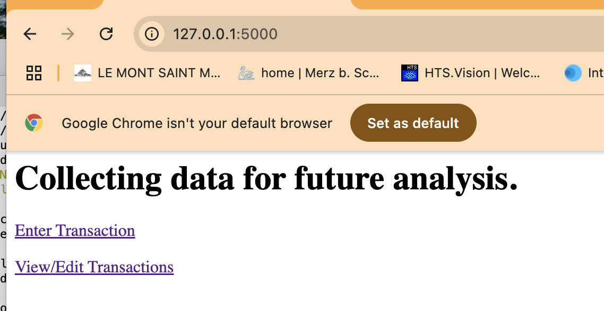
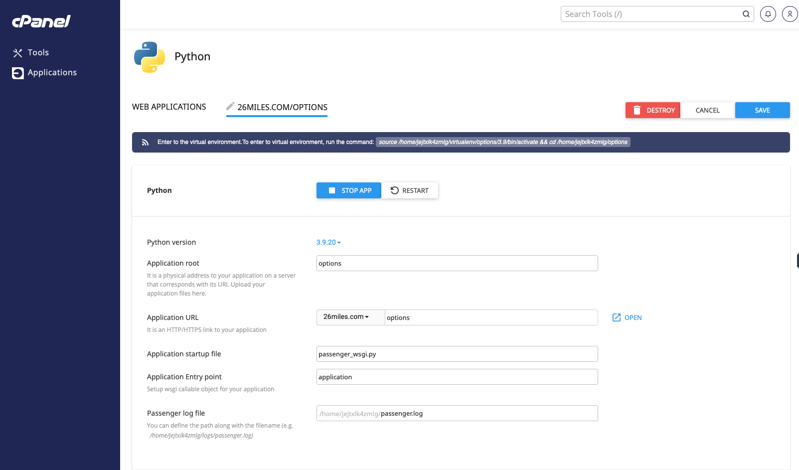
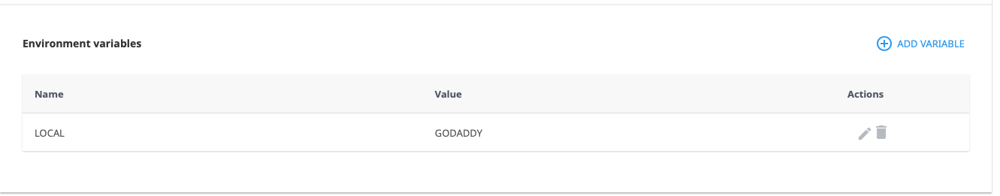
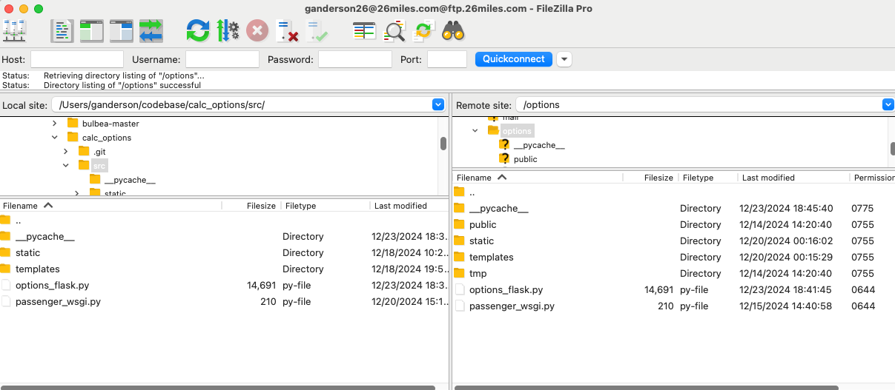

# Project Title

calc_options

## Description

Gather Option Data for the contract.

## Authors

Max Glenn Anderson

## Version History
* 0.6.0
    * Added QUANTITY
* 0.5.2
    * Check to see if session is active. If not, return to login page
* 0.5.1
    * Dropped application level database connection. Connecting and closing for each transaction
* 0.5.0
    * Better transactions.html scrollable tabe. Still have to scroll right, but now columns are aligned
    * Added 'for user_name' to each html
* 0.4.0
    * Added market phase, price direction, standard deviation, upper bound, lower bound, mean, but or sell signal
    * Refactored code into functions
    * Altered OPTIONS_DATA table for new columns
* 0.3.0
    * Added Login/Register
    * Use user_name for transactions instead of entering
    * View transactions only for your user_name
* 0.2.0
    * Set connection variables based on environment variable LOCAL
    * Export transactions to CSV
    * Disable/Enable View Edit button on transactions.html
* 0.1.0
    * Initial Release

## License

* [LICENSE](LICENSE)

## GitHub
* Push branch
```
git checkout -b branchname
git add .
git status
git commit -m "message"
git push -u origin branchname
```

* Merge to main Using GitHub    
* Create Pull request
* Squash and merge


## Getting Started

### For Local Development

#### Install MySQL
* Install MySQL 8.0.40 and MSQL Workbench to create the Database OPTIONS and Tables OPTIONS_DATA and ACCOUNT
```
CREATE TABLE `OPTIONS_DATA` (
  `ID` int NOT NULL AUTO_INCREMENT,
  `USER_NAME` varchar(45) DEFAULT NULL,
  `TICKER` varchar(45) DEFAULT NULL,
  `EXPIRATION_DATE` date DEFAULT NULL,
  `STRIKE` float DEFAULT NULL,
  `CALL_PUT` varchar(45) DEFAULT NULL,
  `BUY_SELL` varchar(45) DEFAULT NULL,
  `DELTA` float DEFAULT NULL,
  `VOLUME` float DEFAULT NULL,
  `BID_ASK` float DEFAULT NULL,
  `ROR` float DEFAULT NULL,
  `IV` float DEFAULT NULL,
  `NOTES` varchar(256) DEFAULT NULL,
  `RESULT` varchar(45) DEFAULT NULL,
  `TRANS_TIMESTAMP` timestamp NOT NULL DEFAULT CURRENT_TIMESTAMP,
  `DIR` varchar(45) DEFAULT NULL,
  `SIG` varchar(45) DEFAULT NULL,
  `PHASE` varchar(45) DEFAULT NULL,
  `CURRENT_PRICE` float DEFAULT NULL,
  `STD_DEV` float DEFAULT NULL,
  `UPPER` float DEFAULT NULL,
  `MEAN` float DEFAULT NULL,
  `LOWER` float DEFAULT NULL,
  `QUANTITY` int DEFAULT NULL,
  PRIMARY KEY (`ID`)
) ENGINE=InnoDB AUTO_INCREMENT=80 DEFAULT CHARSET=utf8mb4 COLLATE=utf8mb4_0900_ai_ci
```

```
CREATE TABLE `OPTIONS`.`ACCOUNT` (
  `ID` INT NOT NULL AUTO_INCREMENT,
  `USER_NAME` VARCHAR(45) NOT NULL,
  `PASSWORD` VARCHAR(45) NOT NULL,
  `EMAIL` VARCHAR(100) NOT NULL,
  `CREATED_TIMESTAMP` TIMESTAMP NOT NULL DEFAULT CURRENT_TIMESTAMP,
  UNIQUE INDEX `USER_NAME_UNIQUE` (`USER_NAME` ASC) VISIBLE,
  PRIMARY KEY (`ID`));
```

#### Install Python packages
* Install Python packages
```
pip install flask yahoo_fin numpy scipy pandas datetime mysql-connector-python Flask.Response
pip install Werkzeug
pip install yfinance
```

#### Environment variable
* For Development on Local, add an environment variable named LOCAL and set to LOCAL. I did this in ~/.bash_profile
* The variable is used in options_flask.py to set the MySQL connection to use the local instance of the database and set all URLs to the local instance of the application. When deployed to GoDaddy, you will need to create the environment variable and set to GODADDY in order to use their server.
```
# Set environment variable for Python apps
export LOCAL="LOCAL"
```

#### Executing the application
* cd to src folder
* * Then run the flask command
```
flask --app options_flask --debug run
```

 * You should see:
```
 * Serving Flask app 'options_flask'
 * Debug mode: on
WARNING: This is a development server. Do not use it in a production deployment. Use a production WSGI server instead.
 * Running on http://127.0.0.1:5000
Press CTRL+C to quit
 * Restarting with watchdog (fsevents)
 * Debugger is active!
 * Debugger PIN: 427-590-107
```
 * Open and browser and go the address



* Exit from the terminal/bash
```
ctrl-c
```


### For GoDaddy Deployment and running

#### Create MySQL Database and Tables
* Log into GoDaddy, select your Domain and go to cPanel
* Select MySQL Databases
* Create the Database and Table

#### Create a Python Application
* Log into GoDaddy, select your Domain and go to cPanel
* From Tools, select Setup Python App. Later same steps but will see your Application
* Create a Python Application



#### Create environment variable

* Scroll down and create the environment variable 




#### Installing Packages
* From your local terminal/bash, SSH into the GoDaddy server
* You will need to get the server address
* And add SSH to your GoDaddy server
```
$ssh jejtxlk4zmlg@50.63.7.156
jejtxlk4zmlg@50.63.7.156's password: ************
jejtxlk4zmlg@p3plzcpnl505185 [~]$ 
```

* Change directory to the directory created by GoDaddy
```
source /home/jejtxlk4zmlg/virtualenv/options/3.9/bin/activate && cd /home/jejtxlk4zmlg/options
```

* Install Python packages
```
pip install flask yahoo_fin numpy scipy pandas datetime mysql-connector-python Flask.Response
```

#### Upload your Application
* I used FileZilla to create the folder structure and upload the application



#### Executing program
* On the cPanel Application, click Run or Restart
* Click Open

## Help

* If you get the following error:
```
mysql.connector.errors.NotSupportedError: Authentication plugin 'caching_sha2_password' is not supported
```
* Try:
```
pip uninstall mysql-connector-python
pip install mysql-connector-python
```

* Pay attention to the package versions. yfinance version 0.2.51 return a different structure vs 0.2.38. I had to make sure to use 0.2.38 locally and on the server.
* GoDaddy had yfinance 0.2.51. I had to SSH into the server and run:
```
pip install yfinance==0.2.38
```
* Server package versions
```
Package                Version
---------------------- -----------
appdirs                1.4.4
beautifulsoup4         4.12.3
blinker                1.9.0
bs4                    0.0.2
certifi                2024.12.14
charset-normalizer     3.4.0
click                  8.1.7
cssselect              1.2.0
DateTime               5.5
fake-useragent         2.0.3
feedparser             6.0.11
Flask                  3.1.0
flask_response         0.0.3
frozendict             2.4.6
html5lib               1.1
idna                   3.10
importlib_metadata     8.5.0
importlib_resources    6.4.5
itsdangerous           2.2.0
Jinja2                 3.1.4
lxml                   5.3.0
MarkupSafe             3.0.2
multitasking           0.0.11
mysql-connector-python 9.1.0
numpy                  2.0.2
pampy                  0.3.0
pandas                 2.2.3
parse                  1.20.2
peewee                 3.17.8
pip                    24.3.1
platformdirs           4.3.6
pyee                   11.1.1
pyppeteer              2.0.0
pyquery                2.0.1
python-dateutil        2.9.0.post0
pytz                   2024.2
requests               2.32.3
requests-html          0.10.0
scipy                  1.13.1
setuptools             75.5.0
sgmllib3k              1.0.0
six                    1.17.0
soupsieve              2.6
tqdm                   4.67.1
typing_extensions      4.12.2
tzdata                 2024.2
urllib3                1.26.20
w3lib                  2.2.1
webencodings           0.5.1
websockets             10.4
Werkzeug               3.1.3
wheel                  0.45.1
yahoo-fin              0.8.9.1
yfinance               0.2.38
zipp                   3.21.0
zope.interface         7.2
```

## Acknowledgments

Inspiration, code snippets, etc.
* [Flask](https://flask.palletsprojects.com/en/stable/)
* From ChatGPT
```
import numpy as np
from scipy.stats import norm

def black_scholes_delta(S, K, T, r, sigma, option_type='call'):
    """Calculates the delta of a call or put option using the Black-Scholes model."""

    d1 = (np.log(S / K) + (r + 0.5 * sigma ** 2) * T) / (sigma * np.sqrt(T))

    if option_type == 'call':
        delta = norm.cdf(d1)
    else:  # put option
        delta = -norm.cdf(-d1)

    return delta

# Example usage:
S = 100  # Current stock price
K = 105  # Strike price
T = 30 / 365  # Time to expiration (in years)
r = 0.05  # Risk-free interest rate
sigma = 0.2  # Volatility

delta = black_scholes_delta(S, K, T, r, sigma, 'call')
print(f"Delta of the call option: {delta:.4f}")
```
